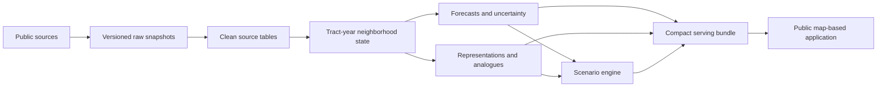

# Neighborhood Housing Intelligence & Digital Twin

An interactive, map-based research platform for exploring how U.S. neighborhoods have changed, how their housing markets may evolve, which past communities followed similar paths, and how model results respond to a small set of plausible scenarios.

This is a data science capstone, not a neighborhood-ranking or home-investment tool. The main work is the longitudinal data system and the models behind it: tract-level data integration, time-aware forecasting, uncertainty estimation, spatial analysis, historical analogues, and transparent scenario sensitivity. The application is where those pieces come together in a form people can actually explore.

> **Project status:** Repository and technical design are being established. The data feasibility study is the next implementation milestone. Features described below are planned unless explicitly marked complete.

## What the finished product should do

A user should be able to select a supported census tract and:

- review its housing, affordability, demographic, economic, development, and environmental history;
- see one-, three-, and—where the data supports it—five-year housing-market forecasts;
- view uncertainty ranges beside every forecast rather than only a point estimate;
- compare the model with persistence and regional baselines;
- find earlier tract-years that looked similar and see what happened afterward;
- compare the tract with its neighbors or another selected area;
- inspect the main factors associated with the model's prediction;
- change a few bounded scenario assumptions and compare the resulting forecast distributions;
- see warnings when a scenario is historically unusual or outside the model's reliable support.

The scenario laboratory will describe model sensitivity, not causal policy effects. The project will not predict individual home values, label neighborhoods as good or bad, or provide buy/sell recommendations.

## Core research question

Can appropriately licensed public data support useful, transferable, interpretable, and uncertainty-aware models of neighborhood trajectories—and can those models power a credible interactive Neighborhood Digital Twin?

The project will also test whether spatial and metropolitan context improve forecasts, whether historical analogues add information beyond simple baselines, and whether uncertainty remains calibrated across locations, time periods, and levels of data coverage.

## Working definition of the Digital Twin

For this project, a Neighborhood Digital Twin is:

> A versioned, time-indexed computational representation of a community that combines observed state, historical transitions, spatial context, forecast distributions, comparable historical states, and transparent scenario sensitivity in an interactive interface.

The name does not imply a perfect replica of a neighborhood, live sensor coverage, or causal simulation. Those limits will remain visible in the application and final report.

## Planned system



The research pipeline and public application are deliberately separated. Databricks Free Edition is the planned environment for larger transformations and MLflow experiments. The public application will load a compact, versioned bundle rather than querying Databricks or rebuilding national data during a user session.

## Initial data scope

The core candidate sources are:

- Federal Housing Finance Agency census-tract House Price Index;
- American Community Survey five-year estimates and margins of error;
- Census tract boundaries and geographic relationship files;
- FRED or ALFRED economic series for national and regional context.

Building permits, employment access, business activity, and environmental risk remain possible extensions. A source is added only when its timing, coverage, geography, licensing, and out-of-time value can be defended. See [DATA_SOURCES.md](DATA_SOURCES.md) for the source policy.

## Modeling plan

The initial model ladder is intentionally conservative:

1. zero-change, historical-average, persistence, and regional baselines;
2. a regularized linear model;
3. one gradient-boosted tree model;
4. spatial-context ablations;
5. quantile or conformal uncertainty intervals;
6. standardized-feature and PCA representations for historical analogues;
7. trajectory clustering or learned embeddings only if the simpler approach is complete and a harder method adds measurable value.

All evaluation will use time-based splits. A separate geographic holdout will test whether the model transfers to metros it did not see during training. Random row splitting is not appropriate for repeated tract observations and overlapping ACS releases.

## Repository map

| Path | Purpose |
|---|---|
| [PROJECT_CHARTER.md](PROJECT_CHARTER.md) | Canonical scope, research questions, non-goals, and definition of success |
| [ROADMAP.md](ROADMAP.md) | Twelve-week delivery plan, decision gates, and team ownership options |
| [docs/](docs/) | Architecture, sequenced implementation guides, decision records, and reference documentation |
| [.github/](.github/) | Pull-request guidance and fast continuous-integration checks |
| [configs/](configs/) | Versioned source, feature, experiment, and scenario configuration |
| [manifests/](manifests/) | Source provenance, checksums, schemas, and build metadata |
| [data/](data/) | Local-only raw, interim, processed, and demonstration data zones |
| [notebooks/](notebooks/) | Numbered exploration and communication notebooks; reusable logic belongs in `src/` |
| [src/](src/) | Reusable acquisition, validation, geography, feature, modeling, simulation, and export code |
| [tests/](tests/) | Unit, contract, integration, regression, and application smoke tests |
| [app/](app/) | Streamlit entry point, pages, components, and static assets |
| [artifacts/](artifacts/) | Local model outputs, diagnostics, and versioned serving bundles |
| [reports/](reports/) | Generated figures, tables, report drafts, and presentation material |
| [scripts/](scripts/) | Thin operational entry points for repeatable local or CI tasks |
| [infrastructure/](infrastructure/) | Databricks, Streamlit, GitHub Pages, and CI/CD configuration when implemented |

Each top-level folder contains a short README describing what belongs there and what should stay out. The full reasoning is in [docs/architecture/repository_structure.md](docs/architecture/repository_structure.md).

## Documentation path

Start with:

1. [Project charter](PROJECT_CHARTER.md)
2. [Twelve-week roadmap](ROADMAP.md)
3. [Documentation index](docs/README.md)
4. [Implementation sequence](docs/implementation/README.md)
5. [System architecture](docs/architecture/system_architecture.md)

For a development environment, follow the [local setup runbook](docs/runbooks/local_environment.md). Python 3.11 is the shared default.

The implementation guide is numbered in dependency order. It is a living technical plan, not a claim that every optional feature must be built.

## Run the current code

The repository is currently a project scaffold with a package import test. The data pipeline, models, report figures, and application have not been implemented yet. These instructions run everything that exists today.

PowerShell:

```powershell
py -3.11 -m venv .venv
.\.venv\Scripts\Activate.ps1
python -m pip install --upgrade pip
python -m pip install -e ".[dev]"
python -m ruff check .
python -m mypy src
python -m pytest
```

macOS or Linux:

```bash
python3.11 -m venv .venv
source .venv/bin/activate
python -m pip install --upgrade pip
python -m pip install -e ".[dev]"
python -m ruff check .
python -m mypy src
python -m pytest
```

As executable pipeline stages are added, this section will list the exact commands needed to acquire permitted data, reproduce analysis, generate every reported figure and table, and launch the application. A required command is not considered complete until it works from a clean checkout using relative paths.

## Development workflow

- `main` is treated as a protected release branch.
- Work happens on descriptive feature branches and is reviewed before merge.
- Notebooks may explore an idea, but reusable transformations and models move into tested modules.
- Large source data, secrets, local MLflow runs, and generated artifacts are not committed.
- Small fixtures, schemas, manifests, configuration, and permitted demonstration outputs are committed when they are needed for reproducibility.
- Model selection stops after a justified champion is chosen; the goal is credible evaluation, not an algorithm contest.

The repository currently provides a minimal installable package and CI smoke test. Until the first data pipeline is implemented, it remains a documented project scaffold rather than a functioning analytical product.

## Planned deployment

- **GitHub:** source of truth, collaboration, code review, CI, releases, and documentation.
- **Databricks Free Edition:** larger ETL jobs, Delta tables, Spark work, and MLflow experiments.
- **Streamlit Community Cloud:** public interactive application using a compact serving bundle.
- **GitHub Pages:** durable methodology site and static fallback.

The public app will not depend on a live Databricks session. That keeps the demonstration usable even when free compute is stopped or quota-limited. The deployment design is documented in [docs/implementation/12_deployment_and_operations.md](docs/implementation/12_deployment_and_operations.md).

## Responsible use

Housing appreciation is not a measure of community worth. Historical housing data reflects segregation, unequal access to credit, displacement, and uneven public investment. The project will show affordability pressure and data limitations alongside housing outcomes, avoid moralized neighborhood labels, audit error and coverage across places, and clearly separate prediction from causation.

## AI assistance

AI Assistance:
OpenAI ChatGPT was used for code debugging, code generation, code organization,
and code methodological brainstorming. All final modeling, implementation,
validation, commentary, and interpretation were performed and verified by the authors.

Model used: GPT-5

The required explanation of the AI workflow, model settings, prompt composition, and output evaluation is maintained in the [AI usage appendix](reports/AI_USAGE_APPENDIX.md).

## License

Project code is released under the [MIT License](LICENSE). Source datasets retain their own terms, licenses, and attribution requirements.
