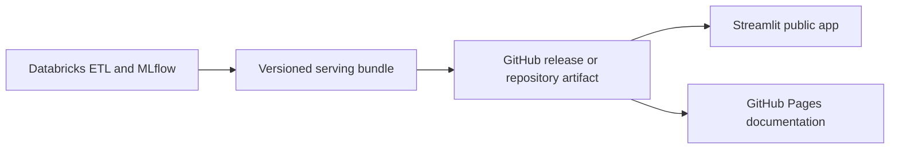

# Twelve-Week Roadmap

This roadmap turns the [project charter](PROJECT_CHARTER.md) into weekly outcomes. It is designed to work for one person or a small team. Optional work can move, but the decision gates and integration order should remain stable.

## Week 1 — Repository, charter, and technical skeleton

**Work**

- Establish the repository structure, documentation path, branch workflow, and contribution rules.
- Confirm the Digital Twin definition, research questions, audience, non-goals, and success criteria.
- Create a low-fidelity application wireframe using synthetic records.
- Set up the Python package, formatting, tests, and a minimal CI check when the first runnable code is added.

**Exit evidence**

- A new contributor can explain the project from the README and charter.
- Folder ownership and handoffs are clear.
- The roadmap and technical guide agree about the order of work.

## Week 2 — Data feasibility and geography decision

**Work**

- Profile the current FHFA tract HPI file, including date range, missingness, and tract coverage.
- Pull a small ACS feature set with both estimates and margins of error.
- Test GEOID compatibility and joins for three representative metros or states.
- Build one-year targets and simple persistence and regional baselines.
- Estimate national storage, runtime, and Databricks quota needs.

**Exit evidence**

- Coverage and attrition report.
- First tract-year modeling table.
- Initial baseline scorecard.
- Written choice among national tracts, selected metros, or the county fallback.

**Gate 1:** Geography is feasible enough to continue.

## Week 3 — Versioned acquisition and bronze data

**Work**

- Implement source definitions, download parameters, retrieval metadata, hashes, and schema fingerprints.
- Acquire FHFA, ACS, boundaries, relationship files, and selected economic series.
- Preserve source date, reference period, publication date, and retrieval date separately.
- Create immutable bronze tables or files and small committed fixtures.

**Exit evidence**

- Re-runnable ingestion entry point.
- Source manifest and data-access documentation.
- Schema, row-count, uniqueness, and checksum checks.

## Week 4 — Geography, silver tables, and neighborhood state

**Work**

- Implement the canonical 2020 tract policy and cross-vintage mapping.
- Generate tract adjacency and county/CBSA membership.
- Standardize ACS estimates and margins of error without inventing precision.
- Build the first neighborhood-state schema and feed real pilot records into the application shell.

**Exit evidence**

- Validated silver tables.
- Geography join report and pilot map.
- Versioned `neighborhood_state_v0` contract with quality flags.

**Gate 2:** Core state dimensions are frozen; new feature families require an ablation case.

## Week 5 — Exploration, target design, and baselines

**Work**

- Complete coverage, missingness, ACS uncertainty, temporal, and spatial exploration.
- Define forecast origin, source availability, target horizons, and right-censoring rules.
- Lock development, calibration, temporal test, and geographic holdout periods.
- Fit zero-change, historical-average, persistence, regional, and regularized-linear baselines.

**Exit evidence**

- Gold feature and target tables.
- EDA and coverage figures.
- Baseline scorecard with time and geography slices.
- Written leakage audit and locked evaluation protocol.

## Week 6 — Main forecasting models

**Work**

- Fit one nonlinear model for each supported horizon.
- Track data version, features, parameters, seed, metrics, and artifacts.
- Compare against every baseline and remove features whose timing or meaning cannot be defended.
- Produce preliminary residual maps and model explanations.

**Exit evidence**

- Reproducible candidate models.
- Validation scorecard and error slices.
- Draft model card.

## Week 7 — Spatial context and uncertainty

**Work**

- Add lagged neighbor and metropolitan context.
- Run with/without-spatial ablations.
- Fit quantile or conformal intervals using a later calibration period.
- Evaluate coverage and width by year, geography, and data quality.
- Complete the held-out-metro experiment.

**Exit evidence**

- Spatial ablation table.
- Calibrated forecast intervals.
- Calibration figure and geographic generalization result.

**Gate 3:** Select the forecast model and stop broad model search.

## Week 8 — Representations and historical analogues

**Work**

- Build standardized-feature and PCA representations.
- Retrieve only historical tract-years available before the query date.
- Compare analogue outcomes with random matches, persistence, regional baselines, and the supervised model.
- Add trajectory clustering only if the analogue system is complete and stable.

**Exit evidence**

- Versioned analogue table.
- Usefulness and stability analysis.
- Similar-community application module.

## Week 9 — Scenario engine

**Work**

- Select two to four understandable scenario variables with defensible history and units.
- Build a bounded sensitivity grid or a justified conditional simulator.
- Keep dependent variables internally consistent.
- Add percentile, range, and multivariate support checks.
- Test continuity, reproducibility, and historical plausibility.

**Exit evidence**

- Versioned scenario definitions and outputs.
- Scenario validation report.
- Baseline-versus-scenario distribution view.

**Gate 4:** Scenarios are stable, bounded, supported, and clearly labeled as sensitivity analysis.

## Week 10 — Integrated application and deployment

**Work**

- Build the compact serving bundle for selected demonstration metros.
- Complete the map, state, history, forecast, drivers, comparison, analogues, scenario, and methods views.
- Add caching, simplified geometry, accessibility checks, empty states, and visible model/data versions.
- Deploy the public app and a static documentation fallback.

**Exit evidence**

- Public Streamlit URL.
- Public documentation URL.
- Deployment smoke test and recorded fallback walkthrough.

## Week 11 — Locked evaluation and review

**Work**

- Run the locked temporal test after the pipeline and model are frozen.
- Complete feature-family ablations and error analysis.
- Conduct structured review with classmates or mentors.
- Test whether users distinguish predictions, intervals, historical analogues, and scenario sensitivity.
- Draft the final report and choose the strongest original visuals.

**Exit evidence**

- Final evaluation tables and figures.
- User-review notes and resulting changes.
- Full report draft, model card, and ethics discussion.

**Gate 5:** Content freezes; only defects, clarity improvements, and required deliverables remain.

## Week 12 — Reproducibility and capstone delivery

**Work**

- Rebuild a small end-to-end run from a clean environment.
- Verify every command, link, citation, version, and source manifest.
- Scan for secrets, local paths, accidental raw data, and unlicensed artifacts.
- Finalize the report, statement of work, disclosure appendix if required, gallery post, and demonstration video or poster.
- Create a tagged capstone release.

**Exit evidence**

- Final repository release.
- Public app and static fallback.
- Reproducibility checklist and known-limitations list.
- Complete course submission package.

## Team ownership options

### Solo

Work in roadmap order and restrict the public app to a few representative metros. One-year forecasting, one nonlinear model, calibrated intervals, PCA analogues, and a two-variable sensitivity grid are enough for a strong end-to-end project.

### Two people

- **Data and geography owner:** acquisition, manifests, crosswalks, adjacency, state table, coverage, and data tests.
- **Model and product owner:** targets, baselines, forecasting, uncertainty, analogues, scenarios, evaluation, and application.
- Both share research design, interpretation, ethics, visuals, and clean-run verification.

### Three or four people

Divide ownership across data/geography, forecasting/uncertainty, representations/scenarios, and application/deployment. Every workstream must publish to shared data contracts; the project should not become a set of disconnected notebooks.

## Deployment target

Research compute and public serving remain separate:

Databricks is used for learning and batch research work. It is not a public runtime dependency. The detailed deployment runbook belongs in `docs/implementation/12_deployment_and_operations.md`.
