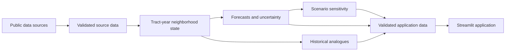

# System Architecture

The project separates reproducible analysis from the public application. Data acquisition, validation, feature construction, model training, and evaluation run as batch work. The Streamlit application reads compact, validated outputs and does not train models or download national datasets during a user session.

## Current repository boundaries

- `src/neighborhood_twin/` contains reusable pipeline, modeling, evaluation, and application-data logic.
- `tests/` verifies that logic with small, redistributable fixtures.
- `notebooks/` is for exploration and communication, not the production pipeline.
- `data/` holds local source and processed data that should not normally be committed.
- `app/` contains the Streamlit interface once implementation begins.
- `reports/` contains the report, AI appendix, and code-generated figures and tables.
- `docs/implementation/` contains the detailed build sequence.

New folders should be added only when a working implementation creates a distinct kind of file that does not fit these locations.

## Data and modeling boundary

The core analytical table has one row per tract and forecast origin. Every feature must retain its reference period and the date it became available so historical backtests cannot use future information. Geography conversions, missingness, and source coverage must remain visible rather than being hidden by the model.

Training consumes versioned, validated tables. Each experiment records its features, target, time split, geographic holdout, parameters, seed, metrics, and output version. Simple persistence, regional, and linear baselines remain part of the evaluation.

## Application boundary

The application receives only the data needed for supported views: tract profiles, history, forecasts and intervals, analogues, explanations, scenario definitions, geometry, and version metadata. It must reject incompatible or incomplete inputs and clearly label unavailable results.

The public application should not require a Databricks token or other research credentials. Research compute may produce application data, but it is not part of the live request path.

## Failure boundaries

The system should fail clearly when:

- a source download is incomplete or changes schema;
- a table has duplicate keys, invalid GEOIDs, or unexpected row loss;
- a feature is unavailable at the stated forecast origin;
- geography matching falls below the accepted threshold;
- model inputs do not match the trained feature definition;
- a scenario is unsupported or outside its permitted range;
- application data is missing, incompatible, or fails validation.

Detailed schemas, configuration files, deployment definitions, and operational instructions should be created alongside the code that uses them, not in advance.
