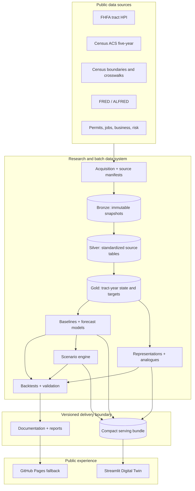

# System Architecture

## Design goal

The architecture must support rigorous research and a reliable public demonstration without turning a twelve-week capstone into a cloud-operations project. It therefore separates batch research compute from lightweight public serving and makes the contracts between stages explicit.

## End-to-end flow



## Layer responsibilities

### Acquisition and bronze

Acquisition code talks to external systems. It records the exact request, retrieval time, source/reference/publication dates, checksum, schema fingerprint, terms link, and raw destination. Bronze snapshots are immutable. If a source changes, the pipeline creates a new version rather than overwriting evidence of what an earlier run used.

### Silver

Silver tables preserve the source's real grain while making identifiers, types, dates, missing-value codes, and units consistent. ACS estimates remain paired with margins of error. Geography conversion is explicit and retains match quality and weighting information. Unexpected records are quarantined or reported rather than silently discarded.

### Gold

Gold contracts are organized around analytical use rather than source layout. The central table is a point-in-time tract-year neighborhood state. Targets, spatial neighbors, forecasts, intervals, analogues, scenarios, and app profiles remain separate versioned contracts so changing one does not force an undocumented change everywhere else.

### Modeling and evaluation

Training consumes only gold contracts and versioned configuration. Each run records the feature version, target version, split definition, parameters, seed, metrics, and artifacts. Evaluation is not a notebook afterthought; it is a separate stage that owns backtests, calibration, slices, ablations, residual maps, and the locked-test result.

### Serving bundle

The serving bundle is the only data boundary the public application needs. A planned bundle contains:

```text
bundle/v1/
├── manifest.json
├── tracts.parquet
├── history.parquet
├── forecasts.parquet
├── analogues.parquet
├── scenarios.parquet
├── geometry_simplified.geojson
├── feature_definitions.json
└── model_metadata.json
```

The manifest records source and model versions, supported metros and horizons, hashes, row counts, minimum app version, and known limitations. The application fails clearly when the bundle is missing, incompatible, or incomplete.

## Local and Databricks parity

The same logical contracts should work in two environments:

- **Local subset path:** Python with DuckDB, Polars or pandas, and small fixtures for development and testing.
- **Databricks path:** Spark SQL or PySpark, Delta tables, jobs, and MLflow for larger runs.

The engines do not need identical implementation code, but they must produce compatible contracts and pass the same important checks. SQL or Spark-only logic should have a small fixture or reference result that local CI can validate.

## Contract and version policy

Use semantic intent rather than a single project-wide version:

- source snapshot version;
- table contract version;
- feature set version;
- target definition version;
- model and calibration version;
- scenario definition version;
- serving-bundle version;
- application version.

Breaking changes require a new contract version and a migration note. Artifacts are never identified only as `latest` in a final result.

## Failure boundaries

The system should fail early at these boundaries:

- acquisition: incomplete response, changed schema, unexpected content type, checksum mismatch;
- silver: duplicate keys, invalid GEOIDs, missing required dates, unit mismatch;
- geography: low match rate, weights that do not sum within tolerance, invalid geometry;
- gold: duplicate tract-year keys, target leakage, impossible lags, unexpected row loss;
- model: mismatched feature contract, wrong split, missing run metadata;
- scenario: unsupported variable, out-of-range input, inconsistent derived state;
- bundle: missing file, hash mismatch, incompatible contract or app version;
- app: unsupported tract, missing forecast, or sleeping/failed dependency presented as a clear user-facing state.

## Deployment boundary

Databricks is not in the live request path. Research jobs create approved outputs, then a bundle validation step publishes the files needed by the public app. Streamlit can redeploy from GitHub without receiving a Databricks token. GitHub Pages holds the methodology and a static fallback. This design costs less, exposes fewer secrets, and remains demonstrable when free research compute is unavailable.
