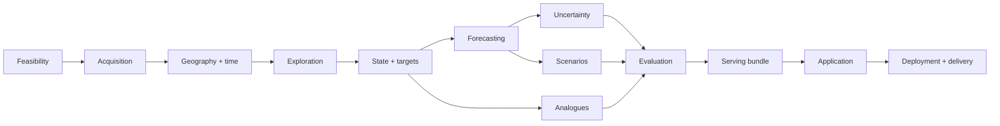

# 00 — Implementation Overview

## Purpose

This guide defines how the project moves from public source data to an interactive research product. It gives each stage a clear handoff and keeps the data science, application, and deployment work connected without forcing them into one large notebook or service.

## Build strategy

Use vertical slices, but mature them in order. The first slice might contain one FHFA file, a few ACS fields, three metros, a persistence forecast, and a rough tract profile. That small slice should already use the planned identifiers, source manifest, timing rules, and output contracts. Later work expands coverage and methods rather than replacing an undocumented prototype.

The major sequence is:

## Shared contracts

The project should converge on a small set of stable products:

- `source_snapshot_manifest`: one record per acquired source object;
- `silver_fhfa_tract_year`: standardized HPI history at the source's honest grain;
- `silver_acs_tract_year`: ACS estimates, margins of error, and release metadata;
- `silver_tract_geography`: canonical tract identifiers, geometry references, and region membership;
- `gold_neighborhood_state`: point-in-time tract-year descriptive state;
- `gold_features`: model-ready, leakage-safe feature rows;
- `gold_targets`: horizon-specific future outcomes and censoring flags;
- `gold_predictions`: baseline and candidate predictions with run metadata;
- `gold_intervals`: calibrated lower and upper bounds;
- `gold_analogues`: query tract-year, neighbor tract-year, distance, rank, and later outcomes;
- `gold_scenarios`: scenario input, support diagnostics, and outcome distribution summaries;
- `app_bundle`: compact profiles, geometry, results, definitions, and metadata for public serving.

Each contract needs grain, keys, types, units, allowed nulls, timing semantics, lineage fields, validation rules, and a version.

## Cross-cutting rules

### Point-in-time validity

Every feature needs both a reference period and an availability date. The forecast origin uses only values that would have been available then. A revised value published later is not silently inserted into an earlier historical training row.

### Geography honesty

Every measure keeps its original geography. County or metro values may provide context for a tract, but they are not relabeled as tract measurements. Crosswalks record their weights and uncertainty.

### Reproducibility

A result points to a source manifest, code commit, configuration hash, feature version, split definition, random seed, model version, and environment. Final figures and app bundles should be rebuildable without manual spreadsheet edits.

### Simple baselines first

Persistence and regional trends are strong competitors in housing. A complex model is useful only when it provides out-of-time improvement, better calibrated uncertainty, or another explicitly measured benefit.

### Research compute is not public serving

The pipeline may use Databricks and large tables. The app loads a small validated bundle. This keeps the user experience fast and avoids exposing cloud credentials.

## Decision gates

1. **Feasibility:** choose the geographic scope and supported horizons.
2. **State contract:** freeze core dimensions and source families.
3. **Forecast model:** select the champion approach and stop broad model search.
4. **Scenario engine:** accept only scenarios that pass support and stability checks.
5. **Content freeze:** run the locked test and prepare the final release.

## Definition of a completed stage

A stage is complete when its output contract exists, can be reproduced on a small fixture, passes its validation checks, records lineage, has a named owner, and is usable by the next stage without opening the producer's notebook. A polished chart alone is not a completed stage.
