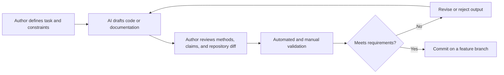

# AI Usage Appendix

This appendix documents how AI assistance was used in the project. It is maintained because AI contributed to repository design, documentation, and code scaffolding. It is not a complete prompt transcript; the capstone checklist identifies a full prompt log as optional.

## How AI fits into the workflow

AI is used as a drafting and development aid. The author defines the task and constraints, reviews the resulting changes, checks them against project and course requirements, runs appropriate validation, and decides whether to revise, retain, or reject the output. AI output is not treated as evidence that code is correct or that an analytical method is valid.

For code, validation may include syntax checks, unit tests, linting, type checks, small known-answer tests, data-contract checks, leakage review, and comparison with a baseline. For documentation, validation includes checking the original source, verifying links and commands, and confirming that planned work is not presented as completed work. Final modeling choices, interpretations, and claims remain the authors' responsibility.

## Models and parameters

| Period or work | Provider and interface | Model | Reasoning effort | Temperature | Other author-selected parameters |
|---|---|---|---|---|---|
| Initial repository and technical design, October 6–7, 2026 | OpenAI ChatGPT/Codex workspace assistant | GPT-5 | Not exposed in the available session metadata | Not exposed or set by the author | None |

The table records only settings that can be verified. A parameter is marked as not exposed when the interface did not provide its value; no value is inferred. Add a new row whenever a different model, interface, or parameter configuration materially contributes to the project.

## How prompts are composed

Prompts are written around a concrete artifact or outcome and normally include:

1. the task to perform;
2. relevant project context;
3. constraints or requirements that must be preserved;
4. the expected form of the output;
5. a quality or verification standard when the task carries meaningful risk.

Routine exchanges are not preserved as a full log. The example below is included because it initiated the repository's structure and affected how later documentation, code, tests, and deliverables were organized. It records a consequential design request rather than ordinary conversational context.

### Actual prompt example

> Design an initial scaffold for the proposed project repo structure. Include readme files to add context and make suggestions on where organization can improve the project's design.

This prompt identifies a concrete artifact—the initial repository scaffold—while asking for enough README context that another contributor could understand the design. It also leaves room to evaluate the organization rather than assuming the first folder structure is final. That mattered because the repository was developed through several rounds of review and simplification rather than accepted as a one-time generated template.

## How AI output is evaluated

AI output is evaluated against the source requirement and the actual repository state, not only for plausibility or writing quality. A change is reviewed through the Git diff, checked for unsupported claims and scope drift, and tested in proportion to its risk. Analytical code will also be evaluated using held-out data, simple baselines, leakage checks, uncertainty calibration, and error analysis as described in the technical implementation guide.

### Actual evaluation example

The repository scaffold was evaluated iteratively rather than treated as correct because the requested folders and README files had been created. After the initial version, the author reviewed the repository tree and found that it included too many speculative folders and documents for a project that had not begun implementation. Follow-up revisions simplified the structure, clarified which documents were authoritative, kept personal planning material outside version control, and retained folders only when they had an obvious current purpose such as data, source code, tests, notebooks, the application, reports, or active documentation.

Each revision was checked against practical questions:

- Can a new contributor understand the project and find the next implementation step from the root README?
- Does each folder have a distinct responsibility that is likely to remain stable?
- Are optional future capabilities described in planning documents instead of represented by empty infrastructure?
- Are code, tests, data organization, application work, reports, and required deliverables separated without creating unnecessary layers?
- Do Git status and ignore rules keep local notes, credentials, source data, generated artifacts, and licensed reading copies out of the public repository?

The structure was accepted only after those reviews led to concrete changes. This is the intended pattern for AI-assisted repository design: generate an initial proposal, inspect it in the context of the real project, remove or reorganize what does not help, and repeat until the organization supports the work that is actually planned.

## Maintenance requirements

- Update the model table when a materially contributing model or configuration changes.
- Keep only prompt examples that materially shaped the project, resolved a significant problem, or recorded an important design decision.
- Add evaluation evidence for major AI-generated analytical code, not every small edit.
- Never include credentials, private data, proprietary source content, or unnecessary personal information.
- Reconcile this appendix with the final code, report, and contribution statement before submission.
