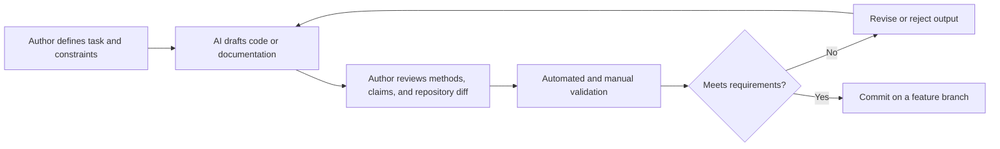

# AI Usage Appendix

This appendix documents how AI assistance was used in the project. It is maintained because AI contributed to repository design, documentation, and code scaffolding. It is not a complete prompt transcript; the capstone checklist identifies a full prompt log as optional.

## How AI fits into the workflow

AI is used as a drafting and development aid. The author defines the task and constraints, reviews the resulting changes, checks them against project and course requirements, runs appropriate validation, and decides whether to revise, retain, or reject the output. AI output is not treated as evidence that code is correct or that an analytical method is valid.

For code, validation may include syntax checks, unit tests, linting, type checks, small known-answer tests, data-contract checks, leakage review, and comparison with a baseline. For documentation, validation includes checking the original source, verifying links and commands, and confirming that planned work is not presented as completed work. Final modeling choices, interpretations, and claims remain the authors' responsibility.

## Models and parameters

| Period or work | Provider and interface | Model | Reasoning effort | Temperature | Other author-selected parameters |
|---|---|---|---|---|---|
| Initial repository and technical design, October 6–7, 2026 | OpenAI ChatGPT/Codex workspace assistant | GPT-5 | Not exposed in the available session metadata | Not exposed or set by the author | None |

The table records only settings that can be verified. A parameter is marked as not exposed when the interface did not provide its value; no value is inferred. Add a new row whenever a different model, interface, or parameter configuration materially contributes to the project.

## How prompts are composed

Prompts are written around a concrete artifact or outcome and normally include:

1. the task to perform;
2. relevant project context;
3. constraints or requirements that must be preserved;
4. the expected form of the output;
5. a quality or verification standard when the task carries meaningful risk.

Routine exchanges are not preserved as a full log. The example below is included because it led directly to a checklist-based repository review and also exposed a failure in how one constraint was interpreted.

### Actual prompt example

> Can you read the Capstone Project Specifications Checklist pdf file and rework/organize anything as needed. Do not do anything that is optional. Also, just focus on code items, but you can make a report folder if you want. Be mindful of the readme instructions

This prompt identifies the authoritative source, permits repository changes, excludes the checklist's optional work, narrows attention to code-facing requirements, and points back to local README rules. Its phrase “focus on code items” was initially interpreted too narrowly: the first revision handled repository requirements but omitted the conditional AI appendix even though AI had been used.

## How AI output is evaluated

AI output is evaluated against the source requirement and the actual repository state, not only for plausibility or writing quality. A change is reviewed through the Git diff, checked for unsupported claims and scope drift, and tested in proportion to its risk. Analytical code will also be evaluated using held-out data, simple baselines, leakage checks, uncertainty calibration, and error analysis as described in the technical implementation guide.

### Actual evaluation example

The checklist-review output was evaluated against both pages of the Capstone Project Specifications Checklist. The review confirmed that the change:

- added direct run instructions to the root README;
- limited `pyproject.toml` to libraries used by current code or required checks;
- documented data access and inline attribution requirements;
- preserved relative paths and excluded populated credentials;
- removed the optional full prompt log.

The evaluation also found a substantive omission: because AI had already been used, the checklist required an appendix with a workflow explanation and diagram, model and parameter details, an actual prompt example, and an actual output-evaluation example. Those items were absent. The author's follow-up identified the gap, the output was judged incomplete, and this appendix was created as the corrective action.

The correction is accepted only when all four conditional requirements are present and linked from the root README. This example shows that successful formatting and static checks do not replace a direct requirement-by-requirement review.

## Maintenance requirements

- Update the model table when a materially contributing model or configuration changes.
- Add an actual prompt example only when the report needs a more representative example than the one above.
- Add evaluation evidence for major AI-generated analytical code, not every small edit.
- Never include credentials, private data, proprietary source content, or unnecessary personal information.
- Reconcile this appendix with the final code, report, and contribution statement before submission.
